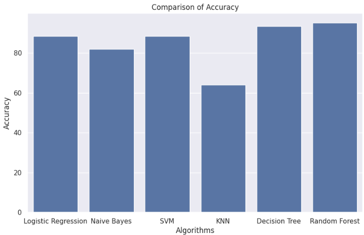
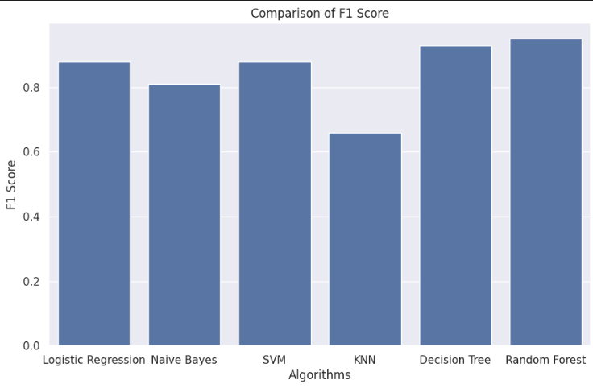
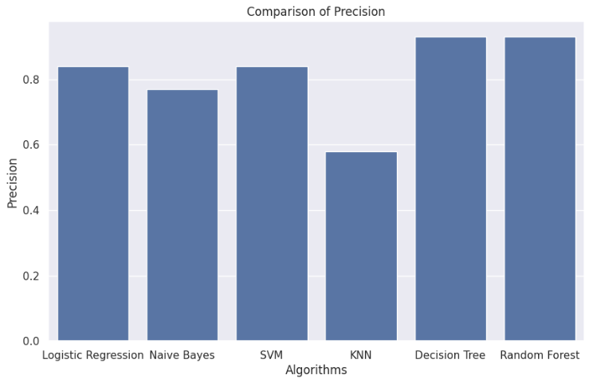
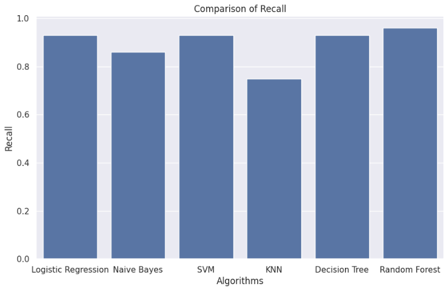
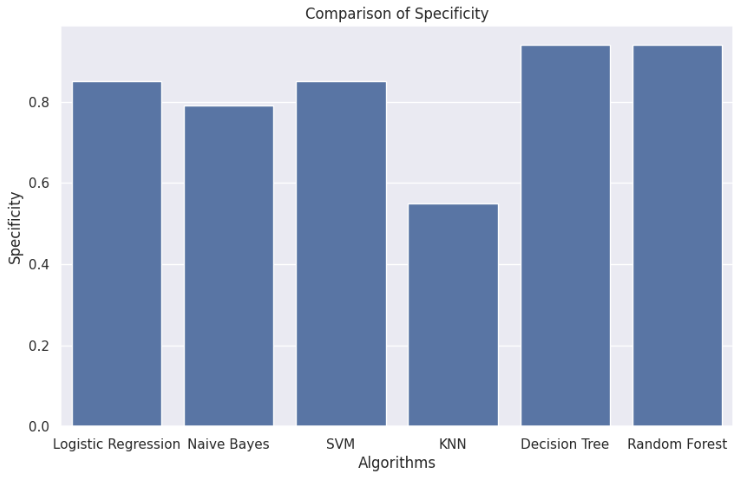
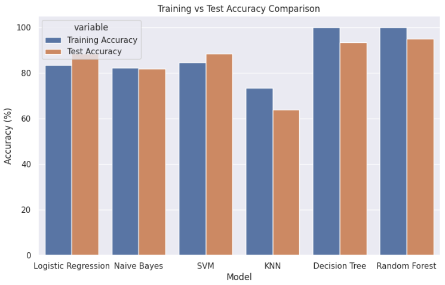

##  Heart Disease Prediction – Project Overview

This project aims to predict the likelihood of heart disease using various machine learning models, comparing their performance, and deploying the best model through a simple user interface.

###  Workflow Summary

1. **Data Preprocessing**  
   We started by cleaning and preprocessing a medical dataset containing various features such as:
   - Age, Sex, Chest Pain Type
   - Resting Blood Pressure, Cholesterol, Fasting Blood Sugar
   - ECG Results, Max Heart Rate, Exercise-Induced Angina, and more.

2. **Model Training**  
   We trained and evaluated multiple machine learning models:
   - **Linear Regression**
   - **Naive Bayes**
   - **Support Vector Machine (SVM)**
   - **K-Nearest Neighbors (KNN)**
   - **Decision Tree**
   - **Random Forest**

3. **Model Evaluation**  
   We compared all models using the following metrics:
   - **Accuracy**
   - **Precision**
   - **Recall**
   - **F1 Score**

   We also analyzed:
   - **Underfitting** (model too simple, high bias)
   - **Overfitting** (model too complex, high variance)

4. **Best Model Selection & Saving**  
   Based on evaluation, the **Random Forest** model performed the best.  
   - We saved it using **Pickle** for later use in deployment.

5. **Deployment with Streamlit**  
   We built an interactive **Streamlit** UI where users can:
   - Input patient data through a simple form
   - Get real-time predictions on heart disease risk

   
   
   
   
   
   

